Das folgende Dokument beschreibt die Installation der Kubernetes-Umgebung sowie der Softwarekomponenten von FASAC. Alle Pfade und Kommandobefehle beziehen sich auf den aktuellen Pfad dieses Dokuments und werden, wenn nichts anderes angemerkt ist, *relativ* angegeben.

## Virtuelle Maschinen für Harvester

### Hardwareressourcen

Für die Testumgebung von FASAC werden zwei virtuelle Maschinen in einer *vSphere*-Umgebung mit jeweils folgenden Hardware-Ressourcen erstellt:

* 32 CPUs
* 256 GB RAM
* 2 TB Festplattenspeicher

In dem Proof-of-Concept wird nur eine Netzwerkkarte/-schnittstelle implementiert. Harvester bietet Network Bonding an, ebenso ein getrenntes Managementnetzwerk. Diese Möglichkeiten sollten im Produktivbetrieb für eine verbesserte Sicherheit und Performance genutzt werden.

Bei der Konfiguration der CPU ist zwingend die Option "Hardwarevirtualisierung" auszuwählen. Der Grafikkartenspeicher muss auf mindestens 128 MB gesetzt werden, sonst verweigert Harvester die korrekte Darstellung des Terminals bei der Installation.

Der Netzwerkbereich wurde auf 172.16.30.0/24 festgelegt mit der *default*-Route 172.16.30.1. 

### Image

Für den PoC wurde die Harvester-Version 1.0.3 verwendet und kann in [Github](https://releases.rancher.com/harvester/v1.1.0/harvester-v1.1.0-amd64.iso) (Stand 26.10.22) heruntergeladen werden.


### Master-Knoten

Die erste installierte Harvester-Maschine ist gleichzeitig der Master-Knoten des Harvester-Clusters. Die Installation ist weitestgehend selbsterklärend. Es wird die Option *New Cluster* ausgewählt. Mit der Option *VIP* (*Fixed Virtual IP*) wird eine virtuelle IP zugewiesen, über die die Weboberfläche von Harvester angesprochen werden kann und sich andere Harvester-Server den Cluster anschließen können. Über den gleichnamigen Installationspunkt wird ein *Token* gesetzt, der bei der Installation weiterer Knoten benötigt wird. Nach einigen Minuten zeigt die Konsole einen erfolgreich eingerichteten Harvester-Knoten.


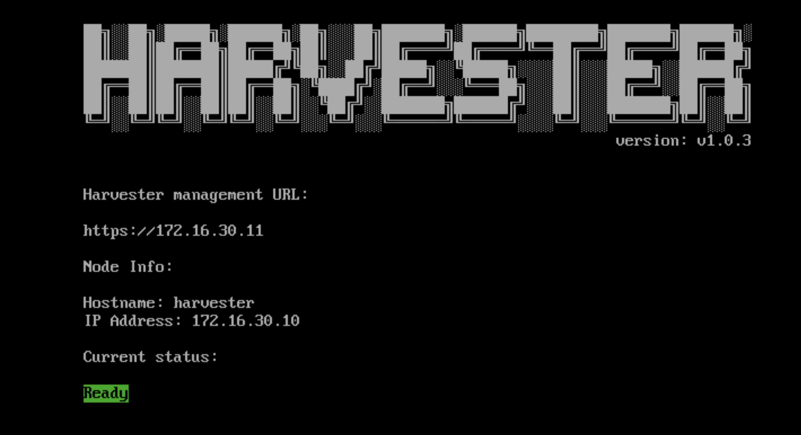


### Slave-Knoten

Bei der Installation der *Slave*-Harvester-Knoten wird die Option *Join Cluster* gewählt. Anschließend muss die VIP-Adresse und der Token der Master-Installation von Harvester eingetragen werden. Der Slave-Knoten registriert sich dann automatisch am Master. Bei einer erfolgreichen Installation zeigt das Terminal die folgende Ausgabe:

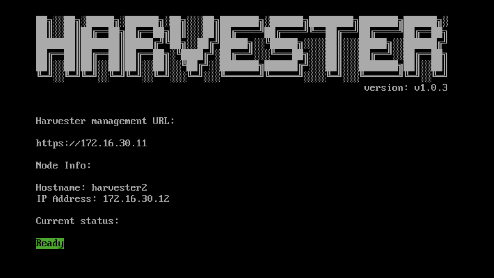

### Ersteinrichtung

Die Ersteinrichtung erfolgt über die *VIP-URL* des Harvester-Clusters. Im PoC ist dies die URL ```https://172.16.30.11```. Über die Option *Hosts* des linken Auswahlmenüs werden alle Server des Cluster angezeigt.

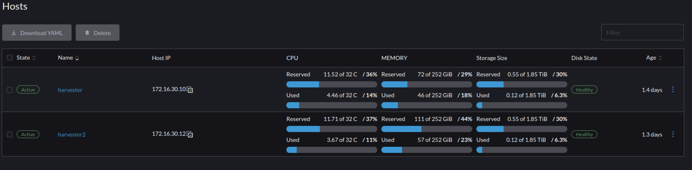


Als Minimalkonfiguration sind hier zwei Einstellungen vorzunehmen. Zum einen muss die Default-Netzwerkschnittstelle ausgewählt werden. Dies wird über die Option *Settings -> vlan* durchgeführt. 

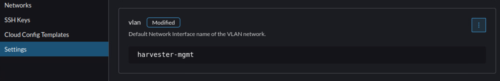


Danach wird ein Standardnetzwerk für die Nutzung durch die virtuellen Maschinen festgelegt. Die Option findet sich in der linken Menüleiste unter *Networks*.

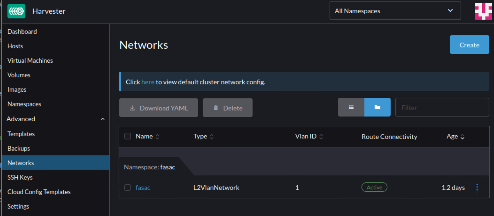


Dieses Netzwerk steht später als Option in Rancher für das zu wählende Netzwerk zur Verfügung.

### Bereitstellung des Cloud-Image

Für die spätere Installation der VMs für Kubernetes-Knoten wird ein entsprechendes Betriebssystemabbild benötigt. Der PoC nutzt hier die das Cloud-Image von Ubuntu in der Version 22.10 (*Kinetic Kudu*). Das Image kann [hier](https://cloud-images.ubuntu.com/kinetic/current/kinetic-server-cloudimg-amd64.img) (Stand: 26.10.22) heruntergeladen werden. 

Über den Menüpunkt *Images* kann das Cloud-Image per File-Upload-Dialog oder einer URL zum gewünschten Betriebssystemabild dem Harvester-Cluster verfügbar gemacht werden. Das Image steht anschließend als Auswahloption (auch in Rancher) bei der Installation von VMs zur Verfügung.

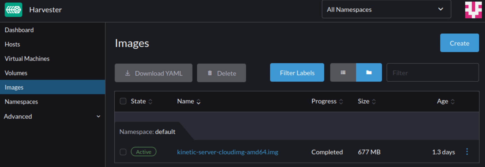

### Cloud Config Template

Im PoC wird für die spätere Verwendung in Rancher und zur Konfiguration der VMs ein *Cloud Config Template* benötigt. Das zu erstellende Template setzt den DNS-Server einer VM auf den Wert ```172.16.30.30```. In anderen Netzwerkumgebungen, in dem der DNS-Server über DHCP bekannt gegeben wird, kann dieser Schritt übersprungen werden.

Folgendes Template muss unter dem Menüpunkt *Cloud Config Templates --> Create --> Network* hinterlegt werden:

```yaml
version: 2
ethernets:
  enp1s0:
    dhcp4: true
    nameservers:
      addresses: 
        - 172.16.30.30
```

In der gleichen Oberfläche wird unter ```User Data``` ein weiterer Eintrag angelegt. Das ist Workaround für einen bekannten [Bug](https://github.com/harvester/harvester/issues/3089).

```yaml
ntp:
  pool: 
  - '172.16.30.30'
packages:
  - nfs-common
  - iptables
```

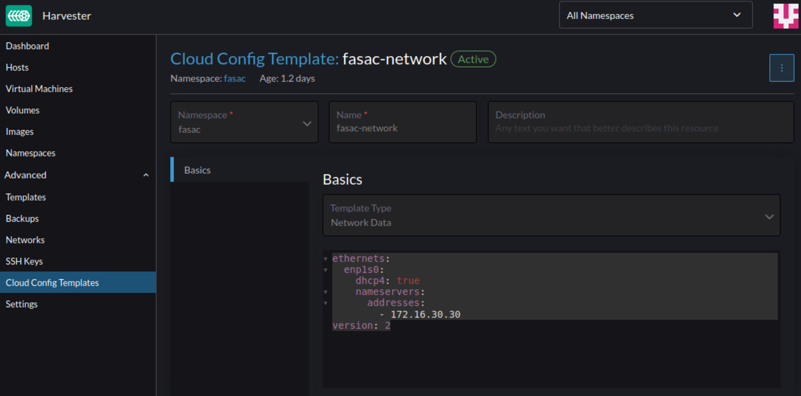

## Rancher

Rancher wird auf einem beliebigen Host des Netzwerks gestartet. Dazu wird eine aktuelle Docker-Installation auf dem System benötigt. Rancher wird zum Erstellen und Verwalten des HA-Kubernetes-Clusters benötigt.

### Installation

Die Installation erfolgt über das Starten eines Docker-Containers:

```bash
docker run -d --restart=unless-stopped \
  -p 80:80 -p 443:443 \
  --privileged \
  rancher/rancher:latest
```
Im PoC wird die IP-Adresse der Maschine (172.16.30.40) im DNS-Server eingetragen und löst die Domain ```rancher.cyber``` auf.

Bei der Erstinstallation von Rancher wird ein Bootstrap-Passwort gesetzt. Dieses kann mit folgenden Befehlen angezeigt werden:

```bash
docker ps # Container ID von Rancher finden
docker logs  <CONTAINER ID>  2>&1 | grep "Bootstrap Password:"
```
Nach Eingabe des Bootstrap-Passworts kann das eigentliche Administrationspasswort gesetzt werden.

## Integration von Harvester

Zur Integration des Harvester-Cluster in die Rancher-Oberfläche wird in Rancher ein Authentifizierungstoken erzeugt, dass dann in Harvester-Verwaltungsoberfläche hinterlegt wird. Die entsprechende Einstellung wird über den linken oberen Menüpunk *Virtualization Management* erreicht. Dort wird der Punkt *Import Existing* gewählt. Nach der Auswahl eines (beliebigen) Namens für den zu importierenden Harvester-Cluster wird eine Authentifizierungs-URL erzeugt.

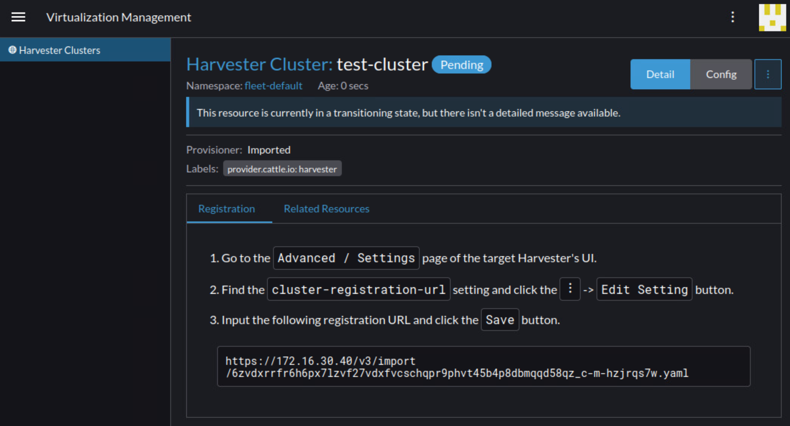

Die URL wird kopiert und in Harvester eingetragen. Die URL wird unter *Settings -> cluster-registration-url* eingefügt.

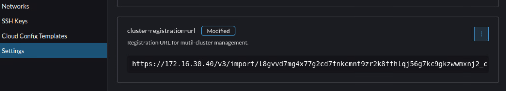

Nach wenigen Minuten erscheint der Harvester-Cluster dann in der Oberfläche von Rancher gesteuert werden und steht für die Erstellung des HA-Kubernetes-Cluster zur Verfügung.

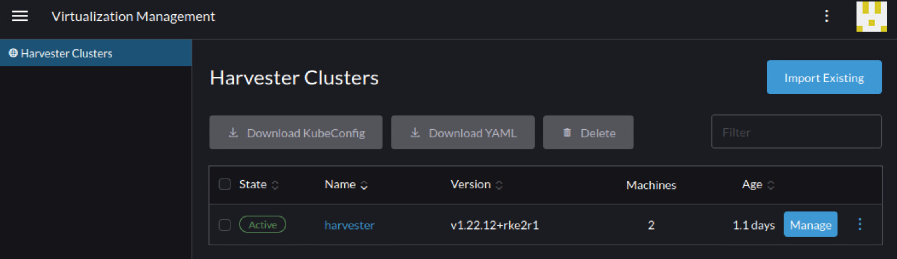

## Einrichtung des Kubernetes-Cluster

### Pool-Konfiguration

Die Installation des HA-Kubernetes-Clusters wird unter dem Menüpunkt *Cluster Management* vorgenommen. Dort ist bereits der *local* Kubernetes-Cluster der Rancher-Installation gelistet. Die Installation des Clusters wird über *Create* gestartet. Im anschließendem Auswahlfenster wird die Option *Harvester* mit der Auswahl *RKE2/K3S* gewählt.

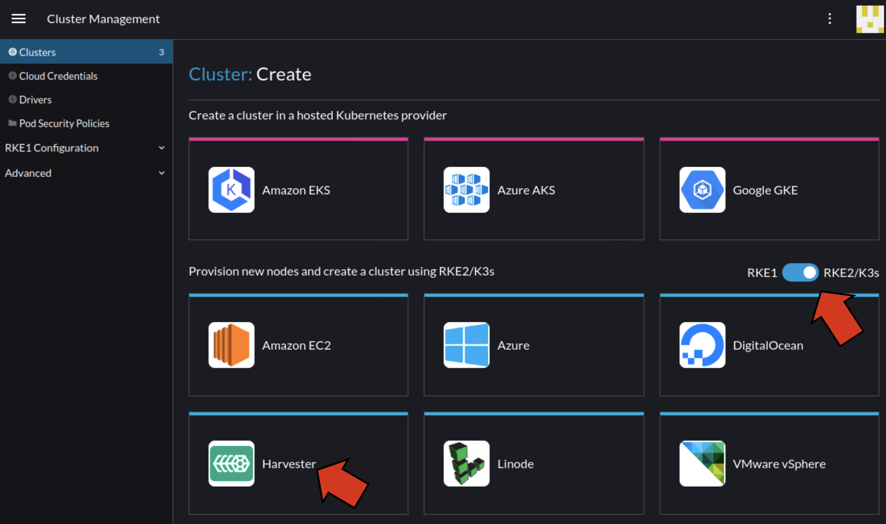

In der folgenden Konfigurationsmaske werden die Parameter der VMs für die Kubernetes-Knoten festgelegt. Im ersten Schritt werden die Cloud-Credentials hinterlegt. Der integrierte Harvester-Cluster steht hierbei direkt als Auswahlpunkt zur Verfügung. Weitere Einstellungen müssen nicht vorgenommen werden.

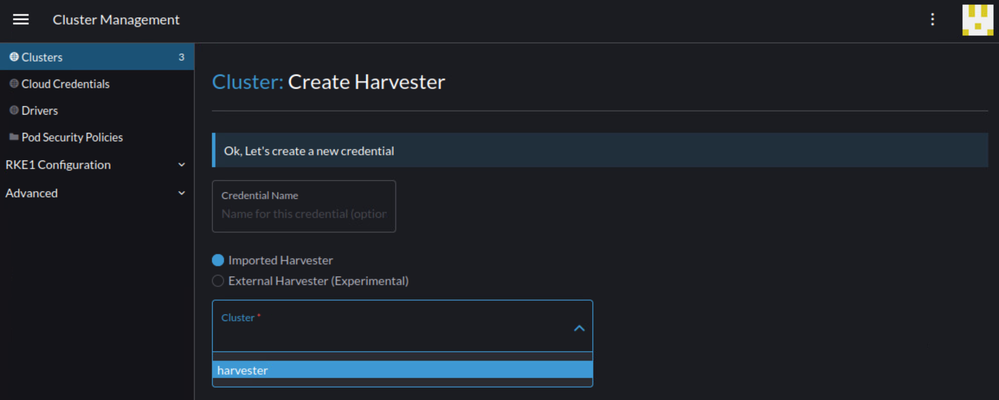

Im wichtigen nächsten Schritt werden die Ressourcen-Pools für die Erstellung der Kubernetes-Knoten festgelegt. In einem HA-Kubernetes-Cluster gibt es verschiedene Typen von Knoten, die sich vor allem durch ihre Aufgabe im Cluster definieren. Rancher unterscheidet hier in *etcd* (Key/Value-Store), *Control Plane* und *Worker*. In einem Knoten des Typs *Control Plane* laufen alle Kubernetes-Systemcontainer, wie z.B. der Kubernetes Scheduer oder der API-Server. In Knoten des Typs *Worker* werden alle vom Nutzer ausgerollten Workloads gestartet. Für eine *High-Availability*-Cluster werden die Systemkomponenten redundant ausgeführt. Dafür werden in dem PoC die nachfolgenden Pool-Einstellungen gesetzt.
Wichtig zu beachten sind die zu setzenden *Taints* bei Pool 3 *pool-longhorn*. Für die Bereitstellung von dynamischen Speicher wird *Longhorn* eingesetzt. Longhorn wird auf jedem erstellten Kubernetes-Knoten automatisch ausgerollt und erstellt aus dem lokalen Speicher aller Einzelknoten einen verteilten Blockspeicher, auf denen die Kubernetes-Ressourcen zugreifen können. Erfahrungsgemäß ist es die beste Lösung, dedizierte Kubernetes-Knoten für einen exklusiven Longhorn-Zugriff zu erstellen. Um zu verhindern, dass später Kubernetes automatisch andere Workloads auf diesen Knoten startet, werden sogenannte *Taints* als Metadaten hinterlegt. Mit dem Taint *NoSchedule* wird das Starten von Pods verhindert. Um zu erreichen, dass definierte Workloads trotzdem auf dem jeweiligen Knoten ausgeführt werden, wird der zuvor festgelegte Taint der Kubernetes-Ressource mitgegeben. Dies führt dazu, dass diese Ausführungssperre ignoriert wird und der Pod auf dem Knoten gestartet wird. 

Im PoC wird Pool3 mit dedizierten Longhorn-Knoten gestartet. Dazu wird der Taint ```node=longhorn:NoSchedule``` gesetzt. Dadurch wird Kubernetes keine Pods auf diesen Knoten starten. Bei der späteren Installation von Longhorn wird der Taint ```node=longhorn:NoSchedule``` in den Installationsanweisungen hinterlegt, wodurch Longhorn die Pods auf den für andere Ressourcen gesperrten Kubernetes Nodes starten kann. 

Nachfolgend sind die Einstellungen der vom PoC genutzten Pools gelistet.

```
Pool1 für Kubernetes-Systemkomponenten

Name:               pool-control
Maschine Count:     3
Roles:              etcd, Control Plane
CPUs:               4 GB
Memory:             16 GB
Disk:               40 GB 
Image:              Dropdown: hinterlegtes Image des Harvester-Clusters (Kinetic Kudu)
Namespace:          Dropdown: Namespace aus dem Harvester-Cluster (für PoC nicht relevant)
Network Name:       DropDown: konfiguriertes Netzwerk des Harvester-Clusters
ssh User:           ubuntu
Show Advanced --> 
  Network Data:     Dropdown: Auswahl des Cloud Config Templates des Harvester-Cluster (DNS)
  User Data:        Dropdown: Auswahl des Cloud Config Templates des Harvester-Cluster (iptables)
```

```
Pool2 für User Workloads

Name:               pool-worker
Maschine Count:     3
Roles:              Worker
CPUs:               8 GB
Memory:             64 GB
Disk:               100 GB 
Image:              Dropdown: hinterlegtes Image des Harvester-Clusters (Kinetic Kudu)
Namespace:          Dropdown: Namespace aus dem Harvester-Cluster (für PoC nicht relevant)
Network Name:       DropDown: konfiguriertes Netzwerk des Harvester-Clusters
ssh User:           ubuntu
Show Advanced --> 
  Network Data:     Dropdown: Auswahl des Cloud Config Templates des Harvester-Cluster (DNS)
  User Data:        Dropdown: Auswahl des Cloud Config Templates des Harvester-Cluster (iptables)
```

```
Pool3 für Dynamic Storage Provider Longhorn

Name:               pool-longhorn
Maschine Count:     3
Roles:              Worker
CPUs:               4 GB
Memory:             8 GB
Disk:               300 GB 
Image:              Dropdown: hinterlegtes Image des Harvester-Clusters (Kinetic Kudu)
Namespace:          Dropdown: Namespace aus dem Harvester-Cluster (für PoC nicht relevant)
Network Name:       DropDown: konfiguriertes Netzwerk des Harvester-Clusters
ssh User:           ubuntu
Show Advanced --> 
  Network Data:     Dropdown: Auswahl des Cloud Config Templates des Harvester-Cluster (DNS)
  User Data:        Dropdown: Auswahl des Cloud Config Templates des Harvester-Cluster (iptables)
  Taints:           Key: node    Value:longhorn    Effect: NoSchedule (!!Wichtig)
```

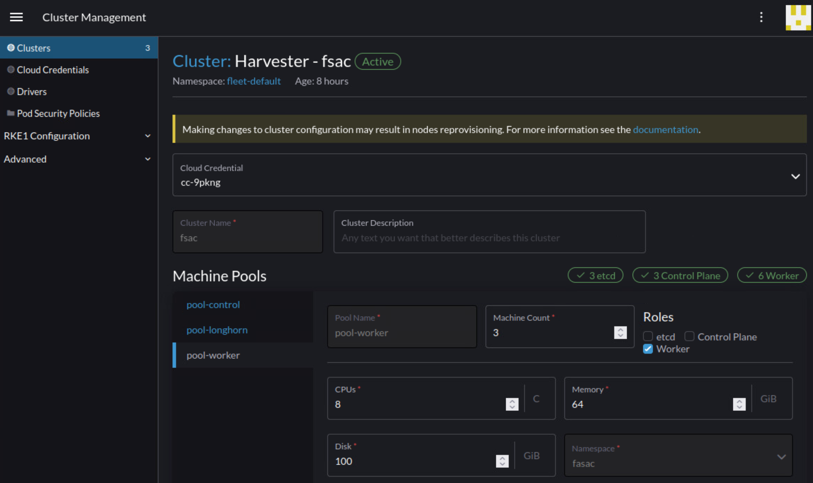

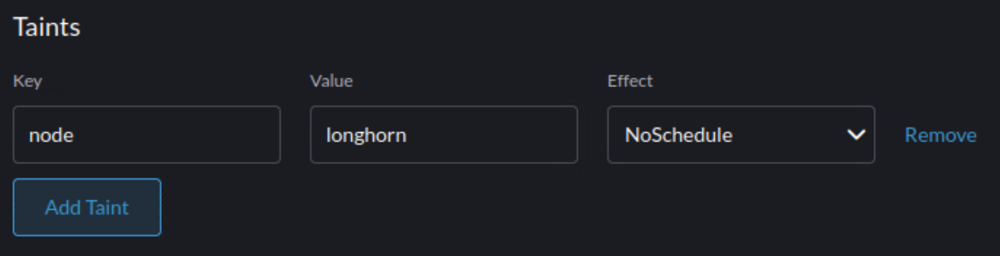

Sind alle Pool-Werte gesetzt, wird Installationsvorgang des Cluster über *Create* gestartet. Die virtuellen Maschinen werden mit den gesetzten Einstellungen auf dem Harvester-Cluster erzeugt. Der Vorgang kann einige Minuten dauern. Bei der Installation für den FASAC-PoC kam es vor, dass der Vorgang auch nach längerer Zeit (>30 Minuten) nicht erfolgreich beendet wurde. Der Grund war eine *Kernel-Panic* einer VM, die nicht erfolgreich gestartet war. Entsprechende Knoten können über Rancher gelöscht werden, sie werden automatisch neu erzeugt. Nach erfolgreicher Installation des Cluster steht der fertig eingerichtete Kubernetes-Cluster bereit.

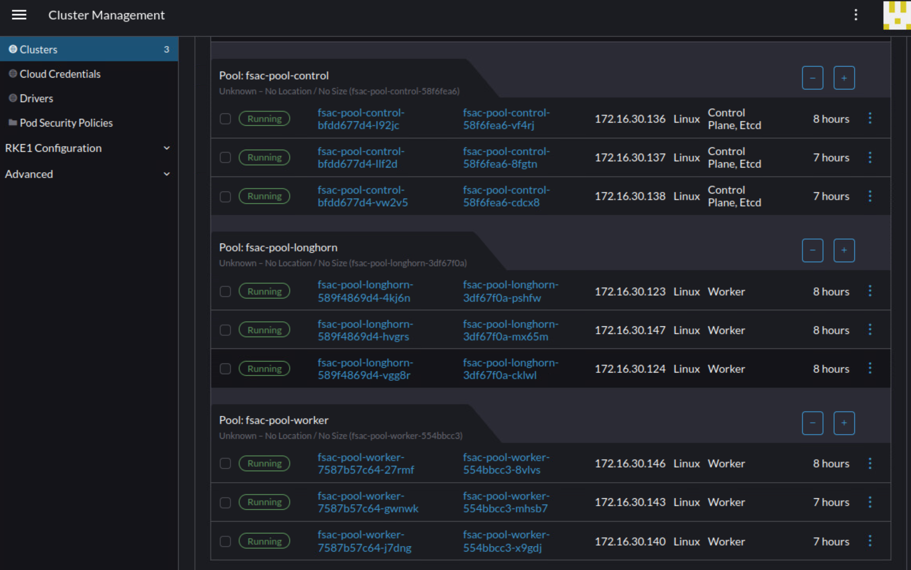

### Kubectl

Für die Steuerung des Kubernetes-Cluster wird neben Rancher das Kommandozeilenprogramm ```kubectl```verwendet. ```kubectl``` wird auf einem Entwicklungsrechner mit Zugang zum Netzwerk ```172.16.30.0/24``` installiert. Für Linux werden folgende Befehle auf der Kommandozeile ausgeführt:

```bash
curl -LO "https://dl.k8s.io/release/$(curl -L -s https://dl.k8s.io/release/stable.txt)/bin/linux/amd64/kubectl"
sudo install -o root -g root -m 0755 kubectl /usr/local/bin/kubectl
kubectl version --client # zum Testen
```

Um den erstellten Kubernetes-Cluster administrieren zu können, muss die Kubernetes-Konfiguration des Clusters heruntergeladen werden. Dazu steht in der Rancher-Oberfläche eine entsprechende Option *Download KubeConfig* im oberen Menüband zur Verfügung. 

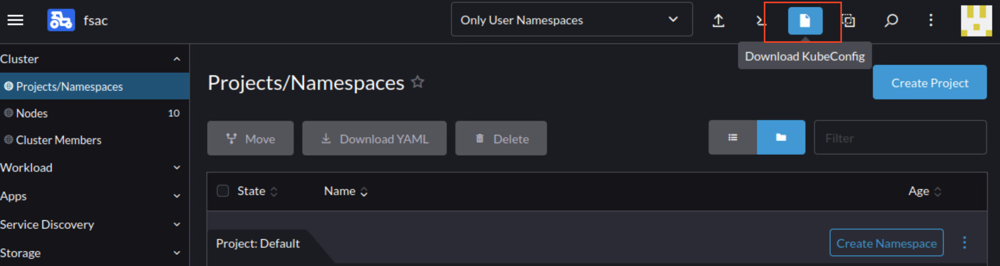

Diese Datei wird dann unter dem Pfad ```$USER/.kube/config``` gespeichert. Der Zugriff auf den Cluster ist nun über die Kommandozeile möglich. Zum Testen kann folgender Befehl ausgeführt werden:

```bash
kubectl get ns
```

## Longorn

Die Installation des Storage Providers *Longhorn* wird über die Oberfläche von Rancher gestartet. Dazu wird der erstellte Cluster über den Menüpunkt *Explore Cluster* ausgewählt. Im Anschluss steht der Punkt *Cluster Tools* zur Verfügung. Dort kann Longhorn über ein Auswahlmenü installiert werden.

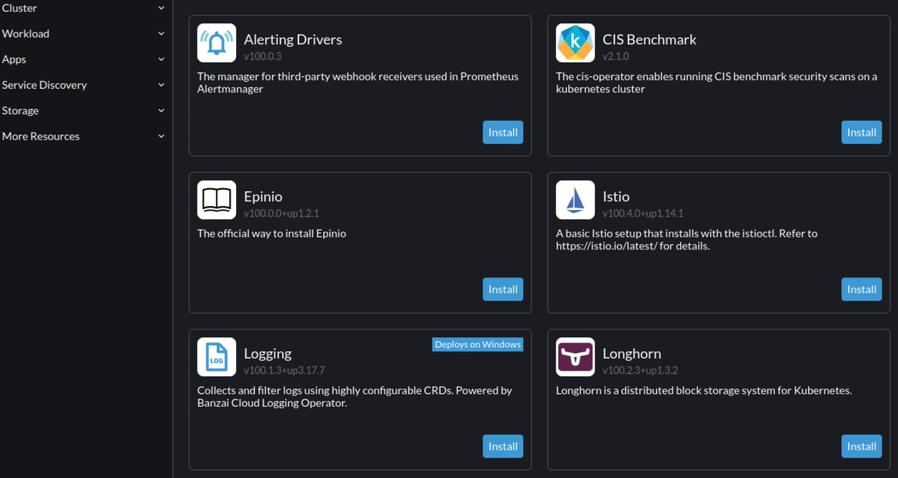

Bevor Longhorn im Cluster installiert werden kann, muss der bereits erwähnte *Taint* hinterlegt werden, um Longhorn auf den dedizierten Kubernetes-Knoten zu installieren. Dazu wird direkt die Installationsressource über den Punkt *yaml* angepasst. 

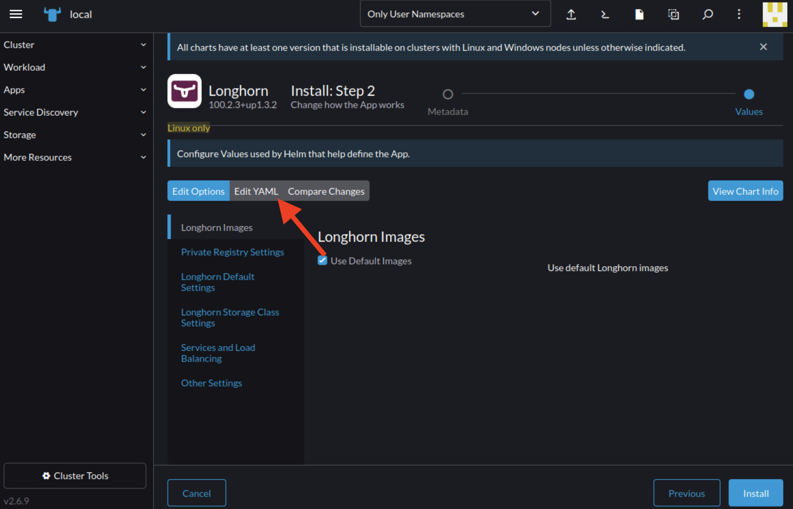

In der sich daraufhin öffnenden YAML-Konfiguration muss an drei Stellen der Taint angepasst werden. Unter den Einträgen *longhornDriver*, *longhornManager* und *longhornUI*  wird der Wert des Schlüssels ```tolerations``` mit folgendem Wert ersetzt:

```yaml
tolerations:
  - effect: NoSchedule
    key: node
    operator: Equal
    value: longhorn
```
Die folgende Abbildung zeigt die angepassten Einträge.

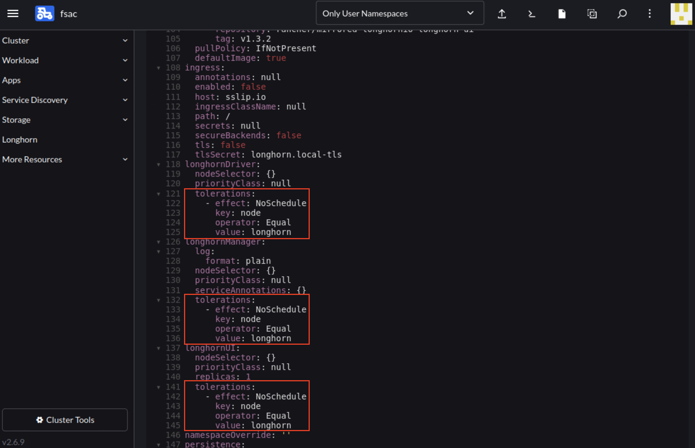

Mit *Create* wird Longhorn im Cluster installiert. Nach erfolgreicher Installation ist ein weiterer Menüpunkt *Longhorn* im linken Menüband vorhanden. Dieser öffnet die Konfigurationsmaske von Longhorn, in dem nur eine Anpassung vorgenommen werden muss. Der *Longhorn Storage*-Treiber hat sich auf allen Workload- sowie den dedizierten Longhorn-Knoten installiert. Deshalb stehen sechs Knoten für den Block Storage zur Verfügung. Um nur den Festplattenspeicher der dedizierten Nodes zu verwenden, müssen alle anderen Knoten für die Bereitstellung von Speicher deaktiviert werden. In der Longhorn-Maske wird der Menüpunkt *Node* ausgewählt und die drei Knoten des ```pool-worker``` für das Scheduling deaktiviert. Dazu werden die entsprechenden Knoten ausgewählt und über *Edit Node* der Eintrag *Node Scheduling* auf ```disabled``` gestellt. Die Abbildung zeigt die drei verbleibenden, dedizierten Longhorn-Knoten für die Bereitstellung von Speicher.

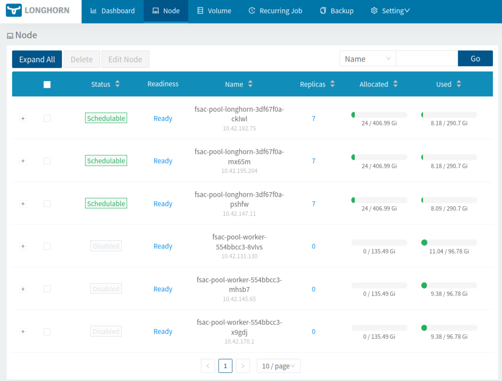

Im letzten Schritt wird der vorinstallierte Harvester Storage Provisioner als ```default```-StorageClass entfernt, da nur **ein** ```default```-Wert für StorageClasses im Cluster existieren kann und im PoC Longhorn verwendet wird. Dazu wird in den Clustereinstellungen der Menüpunkt *More Ressources --> Storage --> StorageClasses* gewählt und bei der StorageClass *Harvester* die Einstellung *Reset Default* aktiviert. Damit ist nur noch Longhorn als ```default```-StorageClass gesetzt.

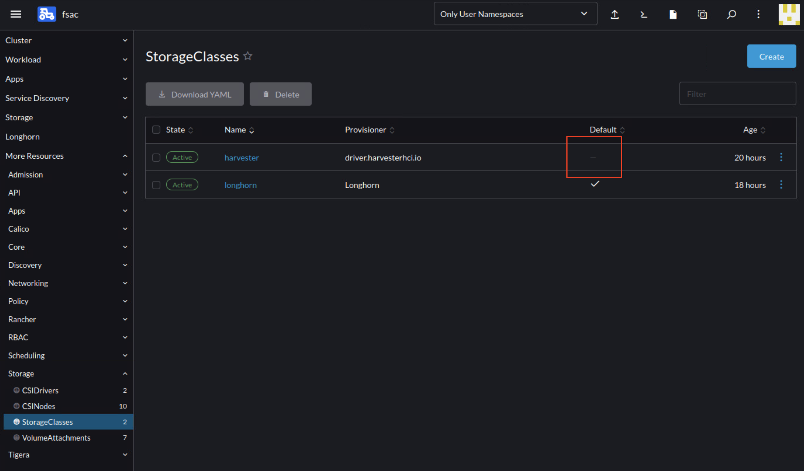

Nach dem Longhorn installiert wurde, erscheint ein Menüpunkt im Cluster-Management *Longhorn*. Unter *Settings --> General* wird in der Spalte *Kubernetes Taint Toleration* der Wert ```node=longhorn:NoSchedule``` gesetzt.

## Helm

Die Kubernetes-Deployments werden typischerweise als dynamisches Helm Template installiert. Dafür wird lokal das Kommandozeilenprogramm ```helm``` benötigt. Mit den folgenden Befehlen wird Helm installiert:

```bash
curl -fsSL -o get_helm.sh https://raw.githubusercontent.com/helm/helm/main/scripts/get-helm-3
chmod 700 get_helm.sh
./get_helm.sh
```

## Harbor

### Installation
Im nächsten Schritt wird die Private Docker Registry *Harbor* installiert. Sie stellt die Docker-Images und Helm-Templates die Kubernetes Deployments zur Verfügung. Zuerst wird ein Namespace für Harbor im Cluster erstellt:

```bash
kubectl create ns harbor
```

Danach wird die Installation von Harbor im Namespace ```harbor``` ausgeführt.

```bash
helm repo add harbor https://helm.goharbor.io #optional
helm fetch harbor/harbor --untar #optional
helm install harbor -f kubernetes/harbor/values.yaml harbor/harbor -n harbor
```

Die ersten beiden Zeilen sind optional, da das Harbor-Template bereits im Projektverzeichnis vorliegt. Die Werte der Datei  ```values.yaml``` sind bereits entsprechend angepasst. Typischerweise sind hier diverse Einstellungen, z.B.für den persistenten Speicher, vorzunehmen, also wo die Anwendung ihre persistenten Daten speichern soll. Durch die Installation des Storage Providers ```Longhorn``` muss dies in der Regel nicht mehr vorgenommen werden, da Longhorn sich als ```default``` Storage Provisioner registriert. Je nach Helm Template können aber trotzdem Anpassungen notwendig sein.

Nach der Ausführung des Kommandos werden verschiedene Pods im Namespace ```harbor``` ausgerollt. Der Installationsvorgang dauert mehrere Minuten. Einige Harbor-Pods befinden sich in der Zeit in Fehlerzuständen, was aber normal ist, da diese von anderen zu startenden Services abhängig sind. Unter dem Menüpunkt *Workloads --> Pods* (hier kann zusätzlich nach Namespaces gefiltert werden) kann der Status der Installation eingesehen werden.

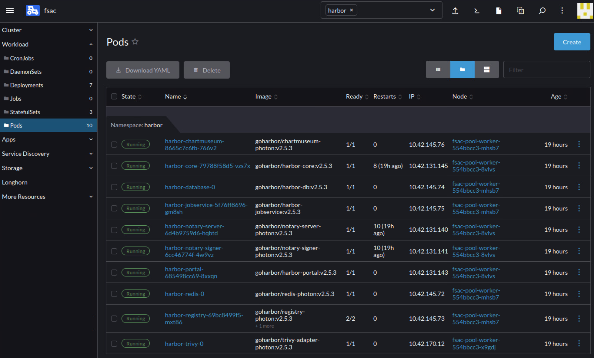

Die Harbor-Einstellungen sind so konfiguriert, dass sie einen Kubernetes-Ingress für die Weboberfläche von Harbor bereitstellen. Sie ist erreichbar unter ```https://harbor.cyber```. Damit die Domain außerhalb des Kubernetes-Clusters abrufbar ist, muss im DNS-Server die Domain mit einer *beliebigen* IP eines Kubernetes-**Worker**-Knoten verknüpft sein. Die für die Knoten vergebenen IPs können in der Cluster-Konfiguration eingesehen werden. Bei einer Neuerzeugung der Knoten (wie im nächsten Schritt zu sehen), werden neue IPs vergeben, weshalb der DNS-Eintrag aktualisiert werden muss. Für den Produktivbetrieb ist der Einsatz eines vorgelagerten Loadbalancers sinnvoll, der eine Weiterleitung an eine Range von IPs vornimmt. 

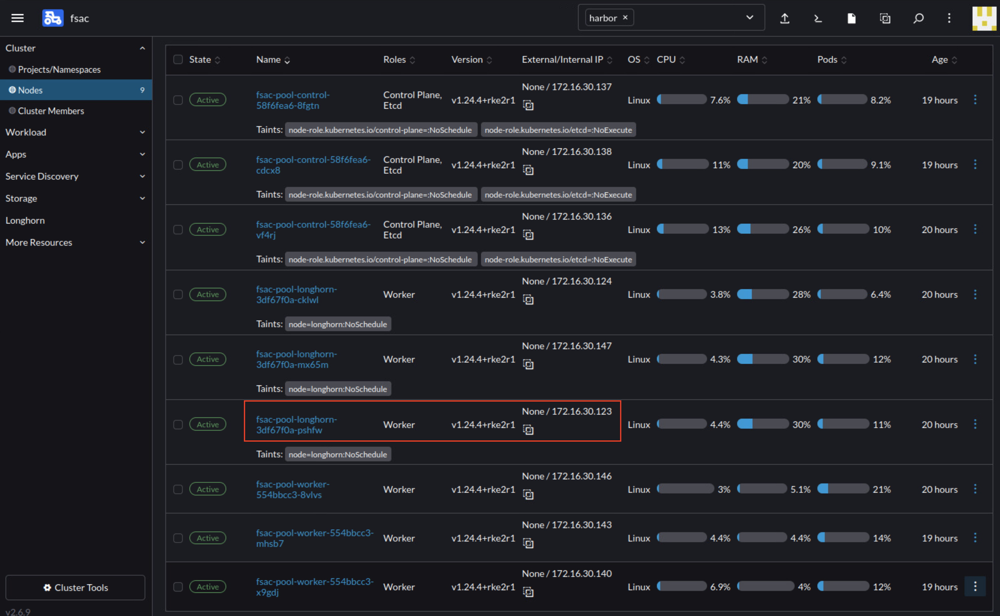

Wurde der DNS-Eintrag vorgenommen, ist Harbor über die URL ```https://harbor.cyber``` erreichbar und kann konfiguriert werden. Über die Template-Einstellung wird folgender ```admin```-User standardmäßig eingerichtet (und sollte nach erstmaliger Verwendung geändert werden):

```yaml
user:     admin 
password: H8uP8iBugUDcFWW
```

Zuerst wird ein neues Projekt unter dem Menüpunkt *Projects* mit einem beliebigen Namen angelegt. Der PoC verwendet dafür ```cyber-range```. Alle hier bereitgestellten Docker-Images beziehen sich auf diesen Projektnamen und nutzen diesen als Teil verschiendenster URLs. Das zu erstellende Projekt wird als *Public* markiert, damit die Kubernetes Workloads (bzw. die Helm Templates) ohne Zugangsdaten auf die Registry lesend zugreifen können. In einer Produktivumgebung sollte hier eine geschützte Registry gewählt werden, die genutzten Helm Templates müssen dann um die entsprechenden Einstellungen ergänzt werden (zumeist die Einstellung ```imagePullSecrets```).

Im zweiten Schritt wird ein Registry-User erstellt, der die Rechte zum Schreiben in die Registry erhält. Unter dem Menüpunkt *Adminstration --> Users --> New User* wird ein entsprechender Nutzer angelegt. Für den PoC wird folgender Nutzer verwendet:

```yaml
user:     cyb
password: Nqn9PuQ2bndXeSv
```

Dieser Nutzer wird dem Projekt ```cyber-range``` zugeordnet. Unter der Einstellung *Projects --> cyber-range --> Members --> User* wird der Nutzer ```cyb``` mit den Rechten eines ```Maintainers``` dem Projekt hinzugefügt.

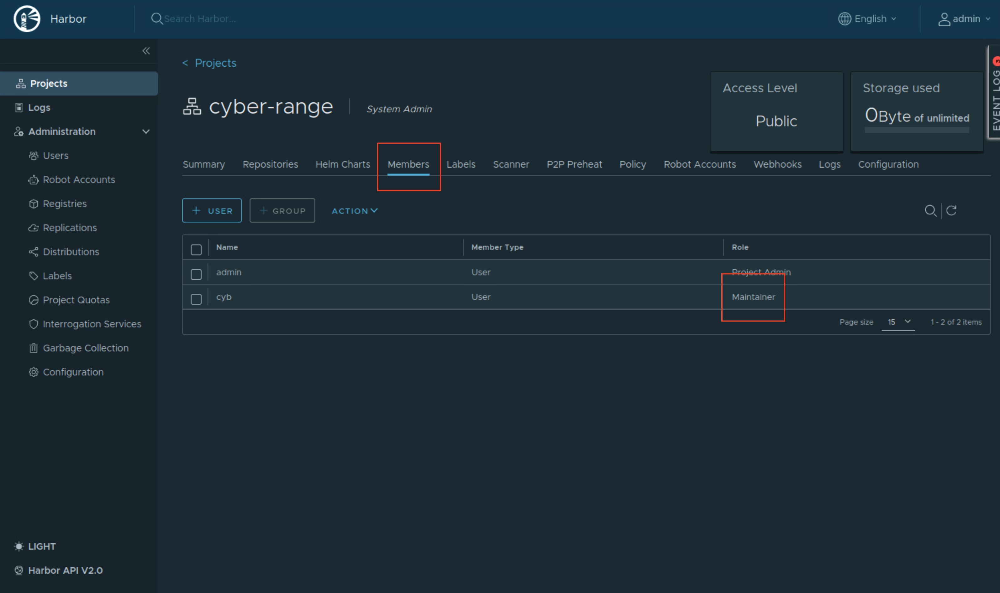

### Harbor Registry Certificate

Jede Docker-Installation, sei es auf dem Entwicklungsrechner oder auf den Knoten der Kubernetes-Knoten, benötigt den Zugriff auf eine Registry, die als vertrauenswürdig eingestuft wird. Dazu muss die ```CA``` der erstellten Registry ```cyber-range``` auf die entsprechenden, auf die Registry zugreifenden System verteilt werden.

#### Download der Registry-CA

Die ```CA``` der Registry lässt sich über den Menüpunkt ```Project --> cyber-range --> Registry Certificate``` herunterladen. Die für den PoC verwendete ```CA``` ist unter dem Pfad ```kubernetes/harbor/ca.crt``` bereitgestellt.

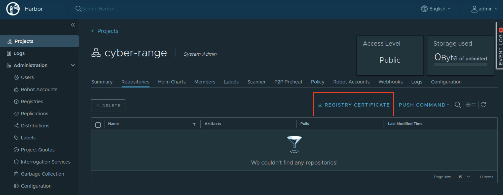

#### Bereitstellung der CA auf Entwicklersystem

Auf dem lokalen Entwicklersystem kann die ```CA``` dem *Certificate Store* der jeweiligen Linux Distribution hinzugefügt werden (das Beispiel zeigt die Vorgehensweise für Ubuntu, für andere Linux Distributionen muss der Befehl entsprechend angepasst werden). Zusätzlich wird der Docker-Installation die ```CA``` für die Domain ```harbor.cyber``` hinterlegt.

```bash
sudo cp kubernetes/harbor/ca.crt /usr/local/share/ca-certificates/
sudo update-ca-certificates --fresh

sudo mkdir -p /etc/docker/certs.d/harbor.cyber
sudo cp kubernetes/harbor/ca.crt /etc/docker/certs.d/harbor.cyber
```

#### Bereitstellung für die Kubernetes Knoten

Entscheidend ist, dass auch den zuvor erstellten Kubernetes-Knoten die Harbor ```CA``` bekannt gemacht wird. Dazu wird die bereits bekannte Pool-Konfiguration in Rancher aufgerufen. Für die Pools ```pool-worker``` und ```pool-control```  wird unter ```Show Advanced --> User Data``` das Harbor ```CA``` eingetragen. Dieser Eintrag darf **NICHT** bei dem Pool ```pool-longhorn``` getätigt werden. Der neue Eintrag führt zu einer Neuerzeugung der Knoten, womit die erstellten persistenten Storages in einen undefinierten Zustand gelangen können (so bei jedem Versuch im PoC). Das bereits ausgerollte Deployment ```Harbor``` kann dann nicht mehr ordnungsgemäß starten. Der nachfolgende Eintrag ist für den PoC unter ```kubernetes/harbor/certificate.yml``` hinterlegt. Der Eintrag ```iptables``` (noch aus der Einrichtung des Clusters) muss erhalten bleiben.

```yaml
packages:
  - iptables 
  - nfs-common
ca-certs:
  trusted: 
  - |                                                                           
    -----BEGIN CERTIFICATE-----
    MIIDEzCCAfugAwIBAgIQWFphcmtZaa/JTw+9mE6MDjANBgkqhkiG9w0BAQsFADAU
    MRIwEAYDVQQDEwloYXJib3ItY2EwHhcNMjIxMTA5MDcyMzAzWhcNMjMxMTA5MDcy
    MzAzWjAUMRIwEAYDVQQDEwloYXJib3ItY2EwggEiMA0GCSqGSIb3DQEBAQUAA4IB
    DwAwggEKAoIBAQDUcd10IO4oXpFxlzew6vJoGJW2MlzbnAMuniSLA/X/elFuWlXJ
    Ome5p1OZIhajveIWslE9UXAokOsYSwcKQ8M2iip9TTPm94gx2r9AnRkDFSQG8fNn
    6EwPB296mIFI9yzYZrTSnMQ5QdwYmtWdpgIhQXK19KndwhIBF5PvK45YBgvlyhAG
    FnZzPCr2dv20yw3QGZmRm3wNGQSTZt5H8eIDI7+sMZVEQnVRGY7kQ/YRJ6blovvF
    lKQH+ny01eyc74aKUf0FbzYAg3KM3tKtSC5QcqAMf/HKitFeti5E5dRCv4xAtK3M
    r5J8tcvRdnw76Y/tSUxLcQpJW/jbnM565fp9AgMBAAGjYTBfMA4GA1UdDwEB/wQE
    AwICpDAdBgNVHSUEFjAUBggrBgEFBQcDAQYIKwYBBQUHAwIwDwYDVR0TAQH/BAUw
    AwEB/zAdBgNVHQ4EFgQUGW2TUwp9aU4j5fSO/bSiJ7dxOGkwDQYJKoZIhvcNAQEL
    BQADggEBAJCfVD4zraElsuf4h0wN+WEfhcdbHbypiD1LkLIvWecrVioHsdkwWPUi
    v+vFbLH+A/adL4fjXG5ZKh7xSaBSiSn2Cp66PbOJIJR2QAy7w+geMWrR8+uajGZN
    KQGV4XtQYkEGMzW5JdIHfepytTvRQCrtaPPdojP+WhJPe1RDGqJA15u22zRfml5H
    qt9c4TvKXH8Y26/nuYgCCB3WhdZMJ7AgHLZ9RWn4/SpGmvFeOky+UWZJlMPEJUII
    jTm+BDbMeSSiNWmwe4bJ28Z4GEMRhJos0caNxf+Jn3IqFt1avGZr2BZiTdCISRPc
    UAdIqWIekqN4kHJ2ijTKChnDZm/hNLM=
    -----END CERTIFICATE-----
```

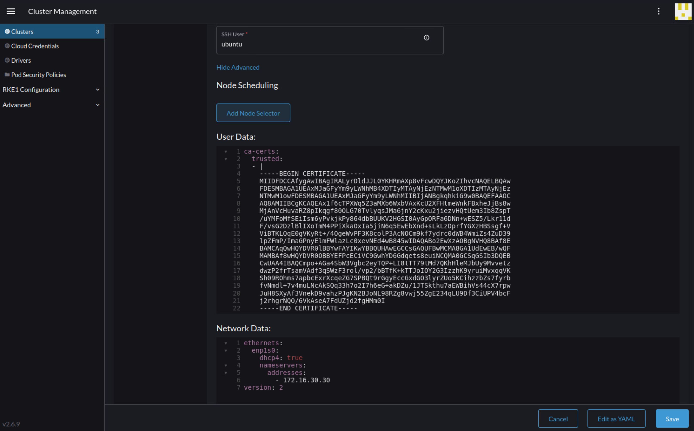

Der Eintrag bewirkt nach dem Speichern, dass die beiden betroffenen Pools komplett neu ausgerollt werden. Da es sich um ein ```Rolling Update```handelt, kann der Vorgang bis zu einer Stunde dauern. Alle Pods von Harbor müssen sich wieder im Zustand *Active* befinden. Eventuell ist es notwendig, die Harbor Pods *Redis* und *Database* zu löschen. Das Harbor Deployment erstellt diese dann umgehend neu. **Zu beachten** ist, dass sich die IP-Adressen ändern und der DNS-Eintrag für Harbor entsprechend angepasst werden muss.

## Zugriff auf die Harbor Docker Registry und Helm Registry

Mit dem Nutzer ```cyb``` kann nun auf die Harbor Registry zugegriffen werden. Dazu loogt sich der Nutzer über die Kommandozeile bei Harbor ein:

```bash
docker login -u cyb harbor.cyber
```

Mit der Einrichtung des Projekts ```cyber-range``` in Harbor steht automatisch auch ein eigenes *Helm Repository* für die Speicherung von Helm Templates zur Verfügung. Helm Templates sind die zentralen Ressourcen für die Bereitstellung von Kubernetes-Ressourcen und werden von den Tasks der AWX-Instanz angesprochen. Um das entsprechende Helm Repository für die Entwicklung lokal verfügbar zu machen, muss der folgende Befehl in der Kommandozeile ausgeführt werden:

```bash
helm repo add --username=cyb --password=Nqn9PuQ2bndXeSv myrepo https://harbor.cyber/chartrepo/cyber-range
helm repo update
helm repo list # muss myrepo als Eintrag anzeigen
```
## AWX

AWX ist eine serverbasierte Anwendung, mit der *Ansible Playbooks* verwaltet und ausgeführt werden können. AWX ist über eine Weboberfläche und über ein REST-API ansteuerbar.

### Installation

Die Installation von AWX erfolgt über den AWX Operator, der über ein Helm Template im Kubernetes Cluster installiert wird. In [Github](https://github.com/ansible/awx-operator) findet sich eine detaillierte Beschreibung der einzelnen Konfigurationsmöglichkeiten für die Installation. Unter ```kubernetes/awx/values.yaml``` sind die für den PoC verwendeten Parameter hinterlegt.

#### Ausrollen im Kubernetes-Cluster

Mit folgenden Befehlen wird AWX im Kubernetes-Cluster ausgerollt:

```bash
kubectl create ns awx
helm repo add awx-operator https://ansible.github.io/awx-operator/
helm repo update
helm install -f kubernetes/awx/values.yaml awx awx-operator/awx-operator --namespace awx
```

Die Installation ist vollendet, wenn folgende Pods erzeugt wurden (das dauert u.U. etwas, da der AWX-Operator manche Pods erst später erzeugt):

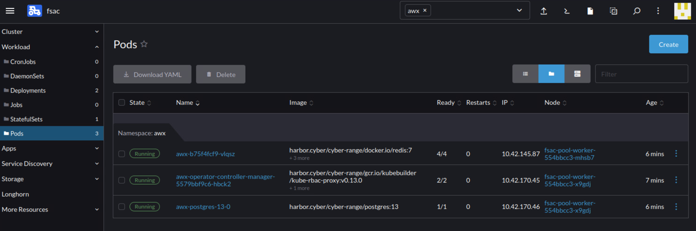

Der Ingress für AWX wurde in der Datei ```kubernetes/awx/values.yaml``` auf ```awx.cyber``` festgelegt. Der Webservice ist dadurch unter ```https://awx.cyber``` erreichbar. Auch hier muss ein DNS-Eintrag auf eine beliebige Kubernetes-Worker-IP gesetzt werden.

### Einrichtung

Für den Zugriff auf die Webseite werden Zugangsdaten benötigt. Diese werden durch AWX automatisch erzeugt. Über die Kommandozeile kann das entsprechende *Kubernetes Secret* abgefragt werden:

```bash
kubectl get secret awx-admin-password --namespace awx -o jsonpath="{.data.password}" | base64 --decode
``` 

Für den PoC wird das folgende Administrator-Zugangsdatum verwendet:

```yaml
user:     admin
password: oapADvzj9suAeywM9jZw1A5UF6n2AUZP
```

### Nutzereinrichtung

Für den Zugriff von FASAC auf die API von AWX wird ein neuer Nutzer eingerichtet. Dazu wird unter *Access --> Users* ein neuer Benutzeraccount vom Typ *normal* angelegt. Der PoC nutzt dabei die folgenden Einstellungen:

```yaml
user:     fasac
password: J4kZhwzRYgR9jq8
```

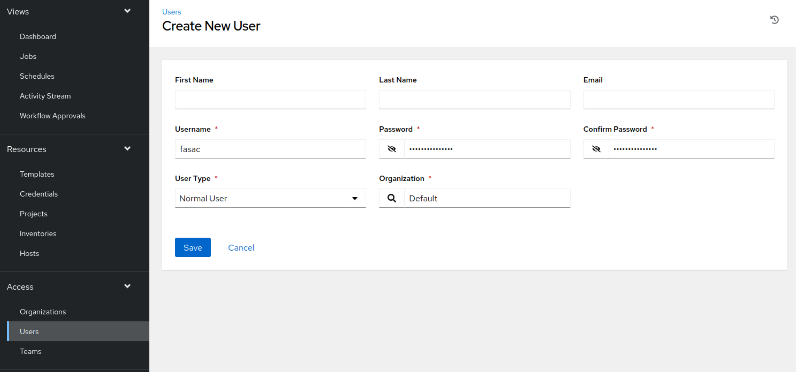

### Project und Git-Zugang

AWX ist an vielen Stellen etwas kleinteilig und die Ersteinrichtung gestaltet sich zum Teil unübersichtlich. AWX erlaubt eine feingranulare Nutzer- und Gruppenverwaltung, die in verschiedene Organisationen untergliedert werden können. Der FASAC-PoC verwendet die voreingestellte Organisation *Default*.


Zuerst wird an dieser Stelle die Einrichtung AWX für den Zugriff auf ein Git-Repository beschrieben. In diesem Git-Repository werden alle Ansible Tasks hinterlegt. Das erleichtert das Entwickeln an den Tasks und erlaubt *Continious Integration*. Dafür werden Zugangsdaten oder ein Token eines Git-Accounts benötigt, der lesenden Zugriff auf das Git-Repository hat.

Dieser Wert wird nun in AWX hinterlegt. Dazu wird unter *Resources --> Credentials* ein neuer Eintrag vom Credential Typ *Source Control* erzeugt. Hier wird das erstellte Token unter der Option *Password* sowie der entsprechende Nutzer des Git-Accounts eingetragen.

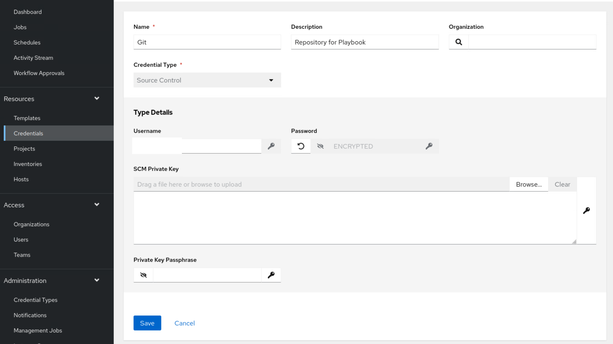

Anschließend wird ein neues Projekt unter *Resources --> Projects* angelegt. Als *Source Control Type* wird *Git* ausgewählt. Die *Source Control URL* zeigt auf die URL des Git-Repositories. Unter der Einstellung *Source Credential* wird der zuvor erstellte Credential-Eintrag ausgewählt. Unter *Source Control URL* wird die URl des Git-Repository eingetragen.

Nach dem Speichern der Einstellungen synchronisiert sich das Projekt mit dem registrierten Gitlab-Account. Am Ende des Vorgangs ist die folgende Ausgabe der Webseite zu sehen:

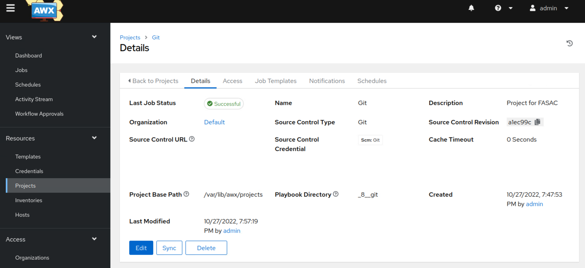

### Inventory

Mit den bisher getätigten Einstellungen kann nun ein Inventory angelegt werden, welches die Ansible Playbooks verwaltet. Dazu wird unter *Resources --> Inventories* ein neuer Eintrag von Typ *inventory* angelegt. 

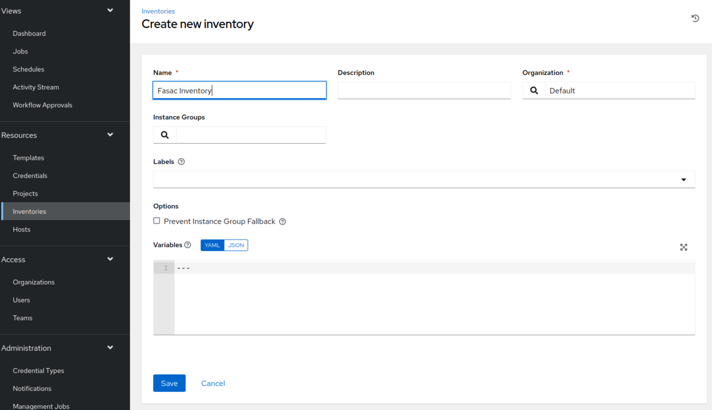

Danach wird dem erstellten Nutzer die Rechte zur Nutzung diese Inventories eingeräumt. Dazu wird unter den Einstellungen des erstellten Inventory der Menüpunkt *Access* aufgerufen und ein neuer Benutzer hinzugefügt.

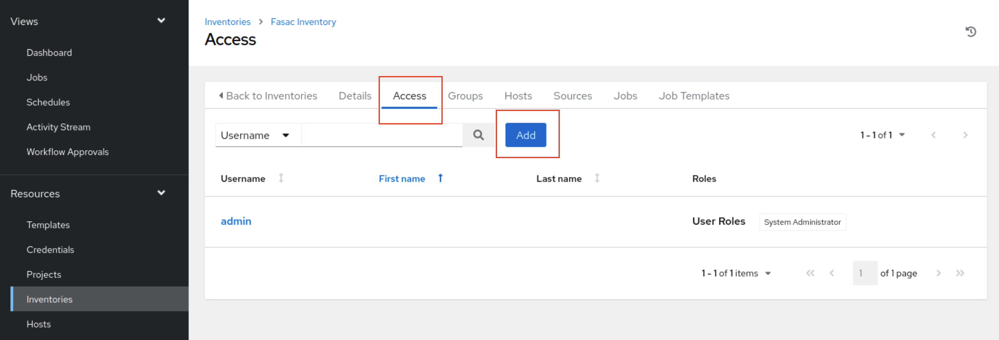

Im anschließendem Auswahldialog werden dem Nutzer die Rechte *Read* und *Use* bei der Benutzung des Inventory gegeben.

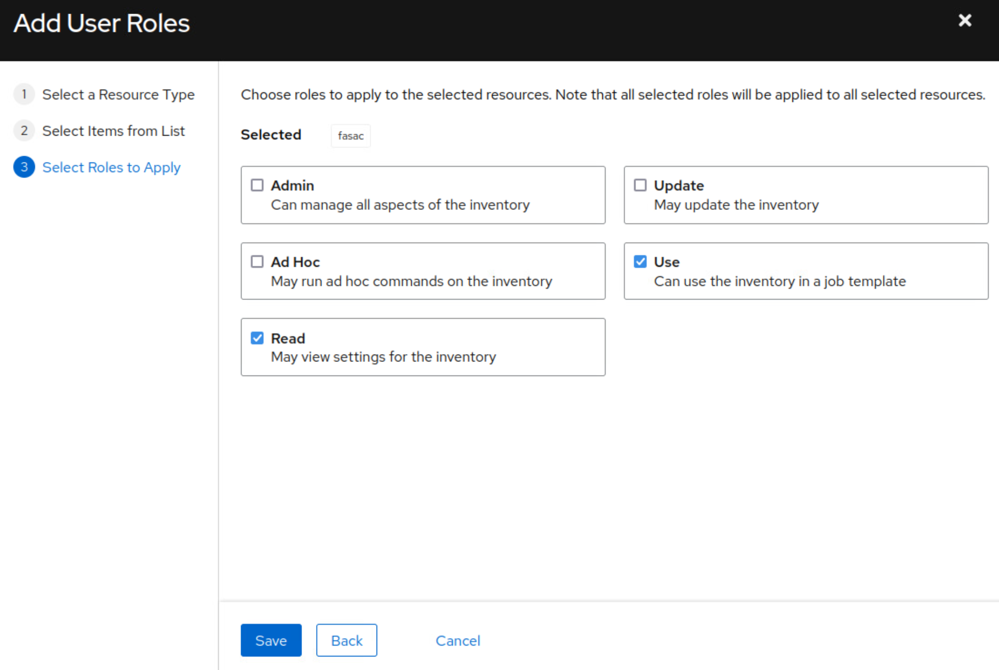

### Job Templates

Zum Schluss werden die eigentlichen Job Templates im Inventory erzeugt und mit den entsprechenden Ansible Playbooks aus dem Git-Repository verknüpft. Dazu wird unter *Resources --> Templates* ein neuer Eintrag erzeugt.

**!!Wichtig** Der Name des Job Templates ist hier entscheidend und muss mit den richtigen Playbooks verknüpft sein.
Der Inventory-Name wird von den Node-Red-Logiken genutzt, um das entsprechende Inventory über die AWX-API aufzurufen. Werden hier oder in Node-Red Änderungen vorgenommen, müssen diese entsprechend in den Node-Red-Modulen oder bei der Bezeichnung der Job Templates bzw. die Zuordnung der Playbooks abgeändert werden.

Folgende Job-Template-Bezeichnungen (Beachtung der Groß- und Kleinschreibung!) und Playbook-Zuordnungen nutzt der PoC (und die Node-Red-Logikmodule) mit Stand 26.10.22:

```yaml
JobTemplate name: Create Directory
Playbook:         create_directory.yml

JobTemplate name: Modify Directory
Playbook:         modify_directory.yml

JobTemplate name: Delete Directory
Playbook:         delete_directory.yml

JobTemplate name: Create File
Playbook:         create_file.yml

JobTemplate name: Modify File
Playbook:         modify_file.yml

JobTemplate name: Delete File
Playbook:         delete_file.yml

JobTemplate name: Helm Install
Playbook:         helm_install.yml

JobTemplate name: Helm Delete
Playbook:         helm_delete.yml
```

Der Pfad zu einem Playbook wird aus dem Git-Account bezogen und kann über den Punkt *Playbook* ausgewählt werden. Der *Job Type* wird auf *Run* festgelegt. Eine weitere **wichtige Einstellung* ist die Aktivierung der Checkbox *Prompt on launch* für das Feld *Variables*. Erst durch die Aktivierung dieser Option ist es möglich, dass die Variablen zur Laufzeit durch FASAC dynamisch gesetzt werden können. Treten Fehler bei der Jobausführung ist diese Einstellung der erste Anlaufpunkt für eine Fehlerbehebung. Bei dem Parameter *Job Inventory* wird da zuvor erstellte Inventory ausgewählt. Bei der Einstellung *Project* wird auf das bereits erstellte Git-Projekt verwiesen. Ganz am Ende der Einstellungsseite für ein Job-Template kann bei Bedarf noch die Option *Concurrent Job* ausgewählt werden. AWX ermöglicht dann, dass mehrere Jobs dieses Job-Templates-Typs ausgeführt werden können. Diese Option muss noch weiter getestet werden, inwieweit sie Auswirkung auf die Ausführung der FASAC-Logiken hat.

Der nachfolgende Screenshot zeigt beispielhaft die Konfiguration für das Job-Template ```Helm Install``` mit dem entsprechenden Playbook ```helm_install.yml```.

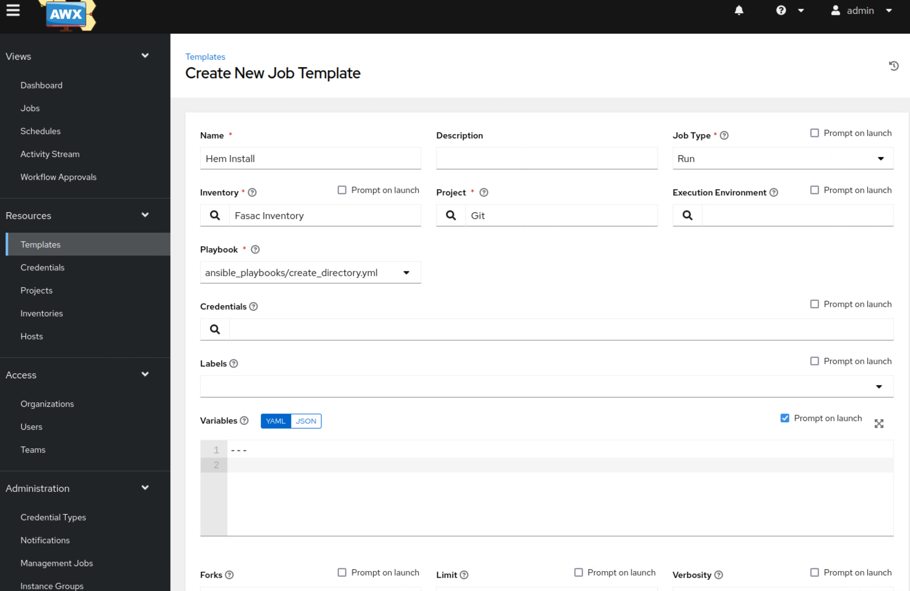


Zum Schluss muss dem AWX-Nutzer noch das Ausführungsrecht für jedes einzelne Job Template gegeben werden. Dazu wird das Job Template geöffnet und die Einstellung *Access --> Add* gewählt. Im Auswahldialog werden dem AWX-Nutzer die Rechte *Read* und *Execute* eingeräumt. Treten bei der Ausführung der Node-Red-Logiken Fehler auf, so ist hier ein weiterer typischer Fehlerfall zu finden (keine Ausführungsrechte für den Nutzer).

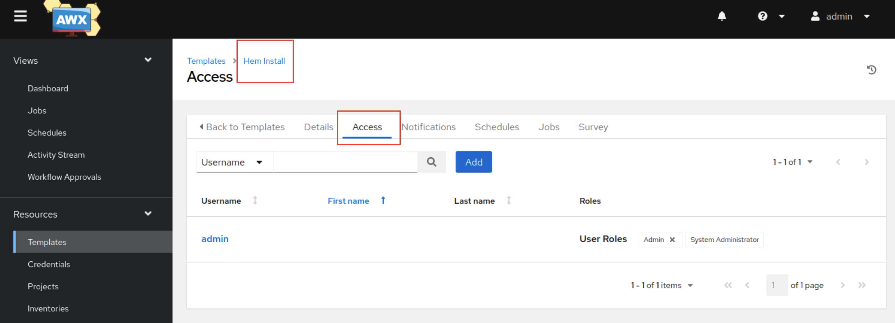

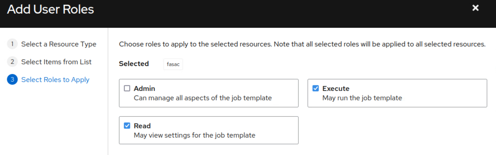

Im PoC sind mit Stand 26.10.2022 folgende Job Templates in AWX integriert:

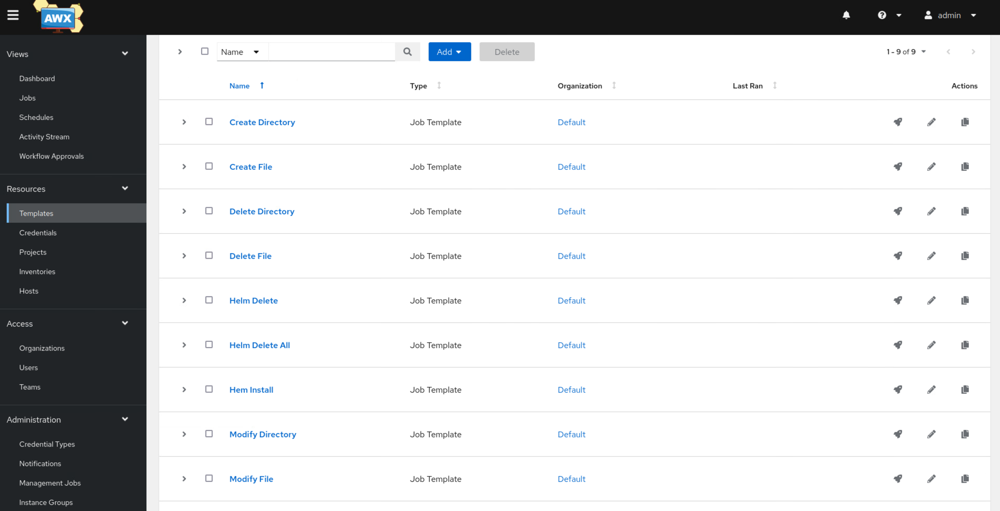

### Custom Execution Environment

AWX startet für jeden auszuführenden Job einen Container, der die notwendigen Tools für die Ausführung der einzelnen Tasks beinhaltet. Dieser Container ist wird bei der Installation von AWX automatisch mit ausgelifert. Für einige der Ansible Module, oder bei nutzerseitigen Anpassungen, muss der Container angepasst werden. Dafür stellt AWX ein Paket mit dem Namen ```ansible-builder``` bereit, mit dem ein angepasster Container mit einfachen Mitteln erstellt werden kann. Unter ```awx-ee/ansible-builder``` ist das entsprechende Paket für FASAC bereitgestellt. In der Datei ```awx-ee/ansible-builder/execution-environment.yml``` werden zusätzliche Inhalte für den Container angegeben. Für FASAC wird das Kommandozeilenprogramm ```helm``` benötigt. Der entsprechende Eintrag für das Herunterladen und Installieren von Helm ist in der ```execution-environment.yml``` eingetragen. 

**Wichtig**: Mit dem Custom-EE wird ein zusätzliches nutzerspezifisches Zertifikat installiert. Es handelt sich um die ```CA``` der Harbor Registry und wird im Pfad ```awx-ee/ansible-builder/user-context/custom-CAs/harbor-ca.crt``` zur Verfügung gestellt. Das ist hier nötig, da sonst die spezifischen Helm-Kommandos nicht auf die Registry zugreifen können. Eigentlich unterstützt Helm als Aufrufparamter eine eigene CA und die Option, unsichere Zertifikate zu ignorieren. Das entsprechende Ansible Modul ist (bisher) fehlerhaft umgesetzt und ignoriert diese Werte. Deshalb wird die ```CA``` in das Basisimage eingebracht.

Mit folgendem Befehl wird der Container erstellt:

```bash
cd awx-ee/ansible-builder/
tox -edocker
```

Ein Container mit dem Namen ```harbor.cyber/cyber-range/awx-ee-custom:latest``` wird damit erstellt. Dieser wird in die Harbor Registry mit folgendem Befehl hochgeladen:

```bash
docker push harbor.cyber/cyber-range/awx-ee-custom:latest
```

In AWX wird nun ein neues *Execution Environment* (EE) mit dem neu erzeugten Container registriert. Danach wird das neu erstellte EE den Job Templates hinterlegt.

Unter *Execution Environment --> Add* wird ein neues EE erstellt. Neben dem Namen wird hier die URL des neu erzeugten Docker Image hinterlegt. Der folgende Screenshot zeigt die zu setzenden Einstellungen der Konfigurationsmaske.


In jedem Job Template muss nun die EE-Einstellung abgeändert werden. Konkret benötigen alle Job Templates mit Helm-Aufrufen die neu erstellte EE. Der Einfachheit halber werden alle Templates mit der neuen EE hinterlegt. 

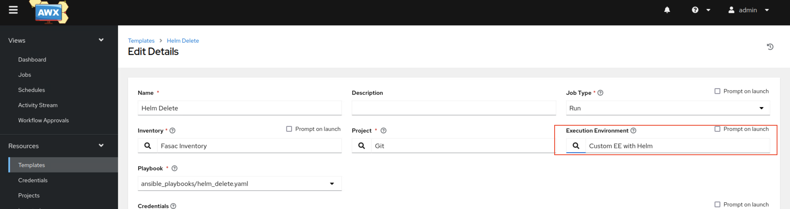

## Node-Red

In den nächsten Schritten wird der grafische Logikeditor Node-Red installiert. Node-Red ist ein auf NodeJS basierendes OpenSource-Projekt von IBM, das eine Flow-basierte Programmierung umsetzt.

### Installation
#### Vorbereitung Helm Chart

Für den PoC (Stand 26.10.22) wird das Node-Red Helm Chart der Firma Schwarz IT in der Version 0.20.0 (23.09.2022) genutzt. Das Helm Chart ist auf [ArtifactHub](https://artifacthub.io/packages/helm/node-red/node-red/0.20.0) veröffentlicht. 
Für die Nutzung in einer Offline-Umgebung ist die Datei unter dem Pfad ```kubernetes/node-red/node-red-0.20.0.tgz``` zur Verfügung gestellt und kann in die private Registry Harbor hochgeladen werden. Dazu wird die Weboberfläche von Harbor unter ```https://harbor.cyber``` aufgerufen und der Menüpunkt *Projects --> cyber-range --> Helm Charts --> Upload* gewählt. Über den File-Upload-Dialog wird die Datei ```kubernetes/node-red/node-red-0.20.0.tgz``` in die Helm Registry geladen. Der folgende Screenshot zeigt das hochgeladenen Node-Red Helm Template Chart in Harbor.

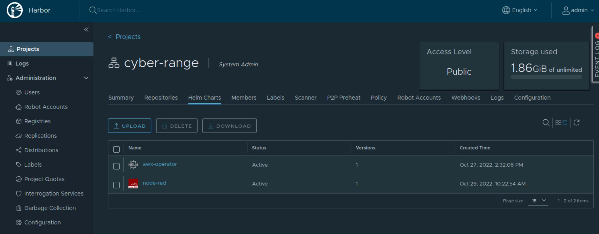

#### Docker Images

Für eine Offline-Nutzung werden die Node-Red-Images in die Harbor Registry geladen.

```bash
docker pull docker.io/nodered/node-red:3.0.2
docker tag docker.io/nodered/node-red:3.0.2 harbor.cyber/cyber-range/docker.io/nodered/node-red:3.0.2
docker push harbor.cyber/cyber-range/docker.io/nodered/node-red:3.0.2

docker pull quay.io/kiwigrid/k8s-sidecar:1.19.4
docker tag quay.io/kiwigrid/k8s-sidecar:1.19.4 harbor.cyber/cyber-range/quay.io/kiwigrid/k8s-sidecar:1.19.4
docker push harbor.cyber/cyber-range/quay.io/kiwigrid/k8s-sidecar:1.19.4
```

#### Ausrollen im Kubernetes-Cluster

Mit Hilfe der folgenden Kommandozeilenbefehle wird Node-Red im Kubernetes-Cluster installiert:

```bash
kubectl create ns nodered
helm repo update
helm install -f kubernetes/node-red/values.yaml nodered myrepo/node-red  --namespace nodered
```

Die Installation ist vollendet, wenn folgende Pods erzeugt wurden:

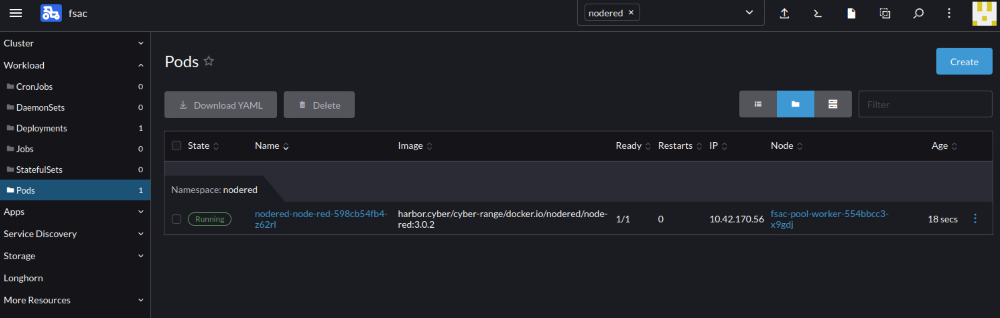


Der Ingress für Node-Red wurde in der Datei ```kubernetes/node-red/values.yaml``` auf ```nodered.cyber``` festgelegt. Der Webservice ist dadurch unter ```https://nodered.cyber``` erreichbar. Auch hier muss ein DNS-Eintrag auf eine beliebige Kubernetes-Worker-IP gesetzt werden. 

### Token für AWX-Zugriff

Für die meisten der in Node-Red bereitgestellten Logikbausteine wird ein valides Token für den Zugriff auf AWX-API benötigt. Um dies zu erzeugen, muss in die Weboberfläche von AWX gewechselt werden. Danach wird unter *Administration --> Applications --> Add* ein Eintrag mit dem Namen ```Node-Red``` erstellt. Als *Authorization grant type* wird der Wert ```Resource owner password-based``` gewählt. Der Punkt *Client type* wird auf ```Public``` gesetzt. Der nachfolgende Screenshot zeigt die entsprechenden Einstellungen.

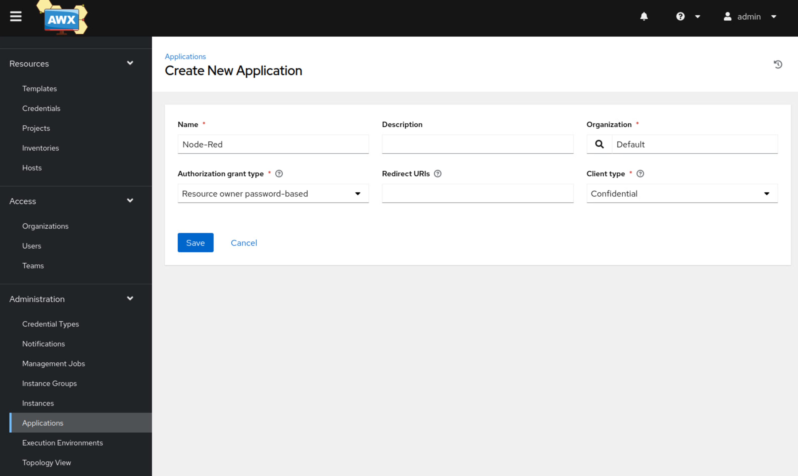

Anschließend muss der Benutzer ```fasac``` an der AWX-Oberfläche angemeldet werden und ein Token erzeugt werden, dass mit der Applikation ```Node-Red``` verknüpft wird. Dazu wird unter *Users --> fasac --> Tokens* ein Token erzeugt.

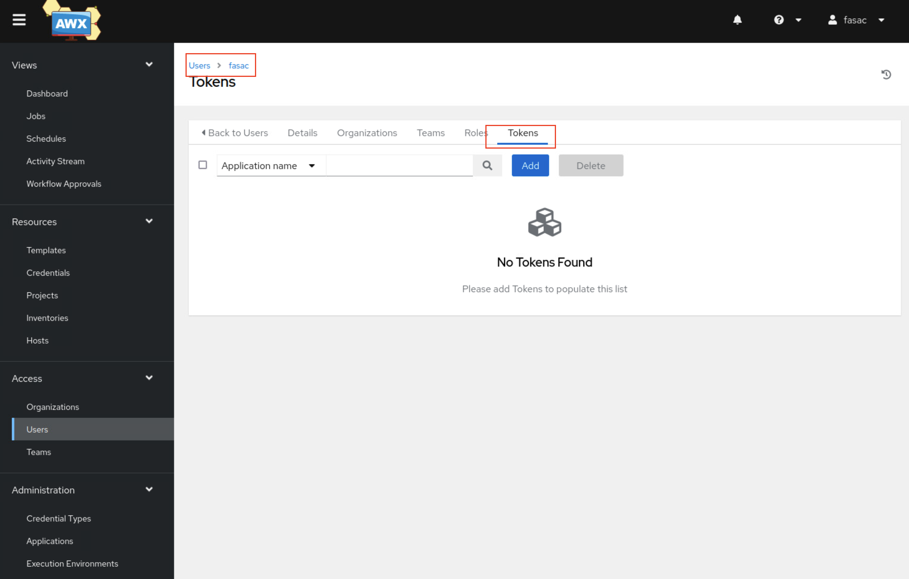

Im nachfolgendem Dialog wird die *Application* ```Node-Red``` ausgewählt sowie der *Scope* auf ```Write``` festgelegt.

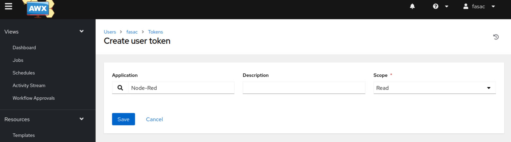

Nach dem Speichern erscheint ein Fenster mit dem Token sowie einem Refresh-Token. Beider Werte werden an geeigneter Stelle gespeichert.

Der erzeugte Token kann nun in allen Logik-Modulen verwendet werden, die einen Zugriff auf die AWX-API benötigen. Hier nocheinmal der Hinweis: Der Token bezieht sich auf die Ausführungsrechte für den Nuzter ```fasac```. Jedes hinterlegte JobTemplate muss einzeln die Berechtigungen für diesen Nutzer erhalten. Im Fehlerfall sollten die entsprechenden Nutzerrechte im JobTemplate und der hier erstellte Token überprüft werden.

### Beschreibung der FASAC-Module

Die Beschreibungen der FASAC-Module sind über die Hilfebeschreibung der einzelnen Module sowie [**HIER**](./node-red/README.md) einsehbar. 

## Installation der FASAC-Module

### Entwicklungsumgebung / -phase
Während der Entwicklung ist es vorteilhaft, die Module möglichst einfach innerhalb von Node-RED zur Verfügung zu stellen. Die hier beschriebene Kubernetes-Umgebung setzt auf Dynamic Provisioning ,it Longhorn, was durch seine dynamisch erzeugten Volumes viele Vorteile bietet, jedoch in der Entwicklungsphase problematisch sein kann. So ist es nicht möglich, von außen auf die Daten des Volumes zuzugreifen und zu verändern. Das Node-RED-Deployment wird ebenfalls mit einem dynamischen Longhorn-Volume gestartet. In diesem Volume werden die persistenten Daten (u.a. die Node-Red-Module und ihre Einstellungen) gespeichert. In einem Longhorn-Volume lassen sich die Node-RED-Module nicht von außen nachträglich installieren oder verändern. Deshalb ist in diesem Szenario ein dynamisches Longhorn-Volume nicht zielführend. Als Alternative wird im Folgenden die Installation eines dynamischen NFS-Provisioner im Kubernetes-Cluster beschrieben, der ein externes NFS-Verzeichnis mounted und darin ein dynamisches Volume für den Node-RED-Pod zur Verfügung stellt. Dieses NFS-Verzeichnis lässt sich dann extern ansprechen und z.B. als Projektpfad in einer Entwicklungsumgebung für Node-RED-Bausteine nutzen.

**Achtung**
Damit diese Methode funktioniert, müssen alle Kubernetes-Knoten im Cluster das Paket **nfs-common** installiert haben. Die hier beschriebene Anleitung legt dafür eine entsprechende [Anweisung im *User Data*-Abschnitt](#cloud-config-template) an, der bei der Bereitsstellung von Kubernetes-Knoten automatisch ausgeführt wird. 

**Installation des NFS-Provisioner im Cluster**

Der folgende Aufruf installiert den NFS-Provisioner innerhalb des Kubernetes-Cluster. Die Werte ``--set nfs.server=172.16.30.99``und ``--set nfs.path=/home/fasac/nfs`` müssen entsprechend den Vorgaben des NFS-Servers abgeändert werden. Der NFS-Server muss im Netzwerk zur Verfügung gestellt werden und vom Kubernetes-Cluster erreichbar sein.

```bash
helm repo add nfs-subdir-external-provisioner https://kubernetes-sigs.github.io/nfs-subdir-external-provisioner/
helm install nfs-subdir-external-provisioner nfs-subdir-external-provisioner/nfs-subdir-external-provisioner --set nfs.server=172.16.30.99 --set nfs.path=/home/fasac/nfs --namespace kube-system
```

**Dynamic NFS PVC**

Im Anschluss wird ein Persistent Volume Claim erzeugt, der den dynamischen Speicher vom NFS-Server anfordert. Auch hier müssen die Variablen ``nfs.io/storage-path`` und der Namespace (muss im Namespace des Node-RED-Workloads installiert werden) angepasst werden:

```yaml
cat <<EOF | kubectl apply -f -
kind: PersistentVolumeClaim
apiVersion: v1
metadata:
  name: nodered-pvc
  namespace: nodered
  annotations:  
    nfs.io/storage-path: "/home/fasac/nfs"
spec:
  storageClassName: nfs-client
  accessModes:
    - ReadWriteMany
  resources:
    requests:
      storage: 10Gi
EOF
```

**Node-RED-Workload mit NFS-Volume**

Damit Node-RED das NFS-Volume einbindet, müssen die Einstellungen des Helm Charts in ``values.yaml`` geändert werden. Das folgende Listing zeigt die entsprechenden Einstellungen:

```yaml
persistence:
  enabled: true
  storageClass: "nfs-client"
  accessMode: ReadWriteOnce
  size: 5Gi
```

Wurden die bereits beschriebenen Pfade und Werte für die Installation von Node-RED in Kubernetes genutzt, so kann mit dem folgenden Helm-Upgrade-Befehl die laufende Node-RED-Instanz im Cluster aktualisiert werden:

```
helm upgrade -f kubernetes/node-red/values.yaml nodered myrepo/node-red  --namespace nodered
```
Alternativ kann der bestehende Node-RED-Workload gelöscht und neu erstellt werden.

**Hinweis**
Werden Daten im NFS-Share geändert (z.B. neue oder abgeänderte Module), so muss der Node-RED-Pod neu gestartet werden, da Node-RED keine Möglichkeit bietet, die Daten *On-The-Fly* neu zuladen.

### Produktivumgebung

Des Weiteren ist die Installation der Module über den [offiziellen Weg von Node-RED](https://nodered.org/docs/creating-nodes/packaging) möglich. Dazu wird aus den FASAC-Module ein Paket erzeugt und auf NPM veröffentlicht. Dafür ist ein Account auf [NPM](https://www.npmjs.com) erforderlich. Nach der Veröffentlichung des Moduls lässt sich dieses im Palettenmanager von Node-RED finden und installieren. Zu beachten ist, dass bei jeder Code-Änderung der Versionszähler des Node-RED-Pakets in der [package.json](./node-red/package.json) erhöht werden muss, bevor es veröffentlicht werden kann.Ebenfalls ist es zwingend erforderlich, dass die Schlüsselwörter "node-red" sowie ```fasac```(für die Suche) in der [package.json](./node-red/package.json) gesetzt sind.

Mit folgenden Befehlen wird das Node-RED-Modul ```node-red-contrib-fasac``` gepackt und auf npm veröffentlicht:
```bash
cd  code/node-red
npm pack
npm publish # user data required
```

## Kubevirt

Kubevirt ist ein Addon für Kubernetes, das es ermöglicht, virtuelle Maschinen innerhalb des Clusters auszuführen. Für den FASAC-Workload *VM: Start* wird Kubevirt benötigt.

### Installation

Folgende Befehle werden in der Kommandozeile ausgeführt:

```bash
export RELEASE=$(curl https://storage.googleapis.com/kubevirt-prow/release/kubevirt/kubevirt/stable.txt)
$ kubectl apply -f https://github.com/kubevirt/kubevirt/releases/download/${RELEASE}/kubevirt-operator.yaml
$ kubectl apply -f https://github.com/kubevirt/kubevirt/releases/download/${RELEASE}/kubevirt-cr.yaml
$ kubectl -n kubevirt wait kv kubevirt --for condition=Available
```

### Support für Emulation

Je nach verwendeter Hardware im Cluster ist es notwendig, den Support von Kubevirt für eine *Emulation* von Hardware zu aktivieren. Eine entsprechende Anleitung findet sich auf der [Github-Seite](https://github.com/kubevirt/kubevirt/blob/main/docs/software-emulation.md) von Kubevirt. Mit dem Aufruf von ```kubectl --namespace kubevirt edit kubevirt kubevirt``` lässt sich die Konfiguration von Kubevirt öffnen. Folgender Eintrag muss hinzugfügt bzw. editiert werden:
```
spec:
  configuration:
    developerConfiguration:
      useEmulation: true
```

## Vorbereitung für FASAC-Szenarien

Einzelne Szenarien werden durch Kubernets Nampespaces repräsentiert. Die Logiken in Node-Red benötigen einen validen Token eines für den Namespace berechtigten Accounts. Zu diesem Zweck wird für jedes Szenario ein eigener Namespace angelegt sowie ein entsprechender Serviceaccount erstellt. Desweiteren wird eine Netzwerkrichtlinie für jeden Namespace eines Szenarios gesetzt, der eine Kommunikation per *default* unterbindet. Eine Ausnahme wird über ein entsprechendes Logikmodul in Nodde-Red eingerichtet.

### Szenario-Namespace

Der Namespace eines Szenarios wird mit folgendem Befehl auf dem Cluster angelegt:

```bash
kubectl create ns apt999
```

### Serviceaccount für den Namespace

Zuerst wird ein Serviceaccount für den Namespace angelegt:

```bash
cat <<EOF | kubectl apply -f -
---
apiVersion: v1
kind: ServiceAccount
metadata:
  name: control
  namespace: apt999
EOF
```

Für diesen Serviceaccount wird ein Secret im gleichen Namespace erzeugt:
```bash
cat <<EOF | kubectl apply -f -
---
apiVersion: v1
kind: Secret
metadata:
  name: control
  namespace: apt999
  annotations:
    kubernetes.io/service-account.name: control
type: kubernetes.io/service-account-token
EOF
```

Eine Zugriffsrolle wird festgelegt, die alle notwendigen Rechte für ein Namespace enthält:

```bash
cat <<EOF | kubectl apply -f -
---
apiVersion: rbac.authorization.k8s.io/v1
kind: Role
metadata:
  name: control-role
  namespace: apt999
rules:
  - apiGroups:
      - ""
      - apps
      - autoscaling
      - batch
      - extensions
      - policy
      - rbac.authorization.k8s.io
      - networking.k8s.io
      - kubevirt.io
    resources:
      - virtualmachines
      - virtualmachineinstances
      - pods
      - componentstatuses
      - configmaps
      - daemonsets
      - deployments
      - events
      - endpoints
      - horizontalpodautoscalers
      - ingress
      - jobs
      - limitranges
      - namespaces
      - networkpolicies
      - nodes
      - pods
      - persistentvolumes
      - persistentvolumeclaims
      - resourcequotas
      - replicasets
      - replicationcontrollers
      - serviceaccounts
      - services 
      - secrets
    verbs: ["get", "list", "watch", "create", "update", "patch", "delete"]
EOF
```

Abschließend wir die Zugriffsrolle dem erstellten Nutzer zugeordnet:

```bash
cat <<EOF | kubectl apply -f -
---
apiVersion: rbac.authorization.k8s.io/v1
kind: RoleBinding
metadata:
  namespace: apt999
  name: control-binding
subjects:
- kind: ServiceAccount
  name: control
roleRef:
  apiGroup: rbac.authorization.k8s.io
  kind: Role
  name: control-role
EOF
```

Mit dem folgenden Befehl kann das Token ermittelt werden:
```bash
kubectl get secret control \
  --namespace apt999 \
  -o jsonpath='{.data.token}' | base64 -d
```

### Netzwerkrichtlinie

Mit folgendem Befehl wird eine Netzwerkrichtlinie erstellt, die eine ausgehende Kommunikation der Pods in einem Namespace verbietet:

```bash
cat <<EOF | kubectl apply -f -
---
apiVersion: networking.k8s.io/v1
kind: NetworkPolicy
metadata:
  name: default-deny-egress
  namespace: apt999
spec:
  podSelector: {}
  policyTypes:
  - Egress
EOF
```

### Labels für die Kontrollschicht

Namespaces für Szenarien werden mit Netzwerkrichtlinien erstellt, die eine ausgehende Kommunikation zu anderen Namensräumen nicht zulassen. Kommunikationsverbindungen zur (notwendigen) Kontrollschicht werden durch Ausnahmen in den Netzwerkrichtlinien erreicht. Eine entsprechende Regel bezieht sich dabei immer auf ein Label. Alle Namespaces der Kontrollschicht bekommen deshalb ein gemeinsames Label. Eine mit diesem Label definierte *Allow*-Netzwerkrichtlinie schaltet dann die Verbindung zu allen Namespaces der Kontrollschicht frei.

```
kubectl label namespace awx plane=fasac-control
kubectl label namespace nodered plane=fasac-control
```

## Kubernetes Workloads für FASAC

Einige Node-RED-Logikbausteine und Ansible Playbooks benötigen für ihre Ausführung Kubernetes Workloads in Form von Helm Charts. Im folgenden Abschnitt wird auf die Installation der entsprechenden Charts eingegangen.

### fasac-control

Der Workload *fasac-control* ist ein Helm Chart, der vom Node-Red-Knoten *Scenario Plane Prepare* genutzt wird. Mit Stand 03.11.2022 ist seine einzige Funktion, Ausnahmen in den Netzwerkrichtlinien (ausgehende Verbindungen) zu setzen. Das Paket ```kubernetes/fasac-scenario/fasac-scenario-0.1.tgz``` wird nach Harbor in das Helm Repository im Projekt *cyber-range* geladen.

### fasac-vm

Der Workload *fasac-control* ist ein Helm Chart, der vom Node-Red-Knoten *VM Start* genutzt wird. Mit diesem Workload werden mithile von KubeVirt virtuelle Maschinen innerhalb des Kubernetes-Cluster gestartet. Das Paket ```kubernetes/fasac-vm/fasac-vm-0.1.tgz``` wird nach Harbor in das Helm Repository im Projekt *cyber-range* geladen.

### Metasploit und Msfvenom

Für die Erstellung eines Meterpreter und zur Interaktion des Meterpreter mit einem Metasploit-C2 werden die Helm Charts ```Metasploit``` und ```Msfvenom```verwendet. Dafür werden die Pakete ```kubernetes/metasploit/metasploit-0.1.tgz``` und ```kubernetes/msfvenom/msfvenom-0.1.tgz``` nach Harbor in das Helm Repository im Projekt *cyber-range* geladen. Mit Stand 03.11.2022 nutzen folgende Node-Red-Module dieses Helm Chart:

- Metasploit: Create Meterpreter (Msfvenom)
- Metasploit: Start (Metasploit)

Mit folgenden Befehlen wird das erforderliche Docker-Image (für beide Charts) in die Harbor Registry geladen:

```bash
docker pull metasploitframework/metasploit-framework
docker tag metasploitframework/metasploit-framework harbor.cyber/cyber-range/metasploitframework/metasploit-framework
docker push harbor.cyber/cyber-range/metasploitframework/metasploit-framework
```

### Mailserver

Für die Erstellung eines Mailserver wird das Helm Charts ```docker-mailserver``` verwendet. Dafür wird das Pakete ```kubernetes/docker-mailserver/docker-mailserver-0.4.tgz``` nach Harbor in das Helm Repository im Projekt *cyber-range* geladen. Mit Stand 03.11.2022 nutzen folgende Node-Red-Module dieses Helm Chart:

- Mailserver: Start

Mit folgenden Befehlen wird das erforderliche Docker-Image (für beide Charts) in die Harbor Registry geladen:

```bash
docker pull mailserver/docker-mailserver:11.1.0
docker tag mailserver/docker-mailserver:11.1.0 harbor.cyber/cyber-range/mailserver/docker-mailserver:11.1.0
docker push harbor.cyber/cyber-range/mailserver/docker-mailserver:11.1.0
```

## Bereitstellung und Anpassungen von Cloud-Images

Beim Erstellen und Starten von virtuellen Maschinen (per KubeVirt) kommen sogenannte Cloud-Images zur. Hierbei ist zu beachten, dass diese Imgaes nicht eins zu eins übernommen werden können, sondern vorher in ein Docker-Image umgewandelt werden müssen, da KubeVirt nur ein solches Format liest. Gleichzeitig kann es je nach Szenario notwendig sein, die Images im Vorfeld anzupassen. Im folgenden Beispiel wird das Cloud-Image für Ubuntu Server 22.10 um das Python-Modul [*attachment-downloader*](https://github.com/jamesridgway/attachment-downloader) erweitert und in ein Docker-Image umgewandelt.

### Herunterladen und Bearbeiten des Cloud-Images

Mit dem folgenden Befehl wird das Ubuntu Server 22.10 Cloud-Image heruntergeladen.
```bash
wget https://cloud-images.ubuntu.com/kinetic/current/kinetic-server-cloudimg-amd64.img
```

Im Anschluss wird das Image mithilfe der Software ```virt-customize``` (muss evtl. installiert werden) angepasst. Der nachfolgende Befehl installiert ```attachment-downloader``` in das Image.

```bash
sudo virt-customize -a kinetic-server-cloudimg-amd64.img --run-command [pip3 install attachment-downloader]
```

### Umwandlung in ein Docker-Image

Abschließend wird das Cloud-Image in ein Docker-Image überführt. Dafür wird ```Dockerfile``` mit dem folgenden Inhalt erstellt:

```bash
FROM kubevirt/container-disk-v1alpha
ADD kinetic-server-cloudimg-amd64.img /disk/
```

Danach wird das Docker-Image gebaut und in die Docker-Registry hochgeladen.

```bash
docker build . -t harbor.cyber/cyber-range/kinetic-server-cloudimg-amd64-custom
docker push harbor.cyber/cyber-range/kinetic-server-cloudimg-amd64-custom
```

Das erstelle Docker-Image kann nun für die Erstellung von VMs mit KubeVirt genutzt werden (z.B. im FASAC-Modul *VM Start*).